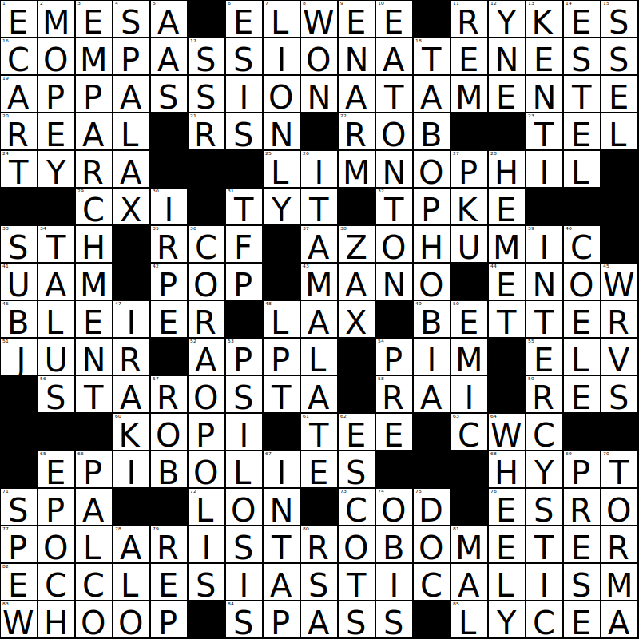

# Crosswordist

Crosswordist is an application that generates random crosswords.

## Getting Started

TODO

## Background

This project was born as a challenge if it's possible to generate randomly a crossword. The idea is
pretty simple: given a list of words, a random valid crossword should be generated from the list.
Since there are many types of crosswords and this project is a kind of challenge american crossword
type was chosen (american crossword type has much more intersections and words than other types).

### Technical Details for Nerds

From the technical point of view the main algorithm is built from two main parts. First the
generation of the valid grid and second is the finding a solution for the grid. 

Generating a grid is a Las Vegas randomized algorithm. By given percentage and symmetry type 
a grid is generated following the rules (i.e., one rule: there should be a for some minimal word
length).

The second part and the heart is the finding solution - a Constraint Satisfaction Problem.
The crossword is represented as a multigraph (i.e., the word and all its intersection with other
words by cells coordinates). First, from all words in the crossword the word with minimal variants
is chosen (this is in order to reduce the search space). Once a word is substituted all its letters 
are propagated to adjacent words. If a propagation has a meaning, that is propagated letters have a
variation that forms a word then, again, from all words in the crossword one with minimal variants
is chosen. If a dead end is reached, the algorithm backtracks.

Since one of the main parts of the algorithm is searching words, there should be a fast way to find
words by provided letters (and as a derivative existence of words by a given letters, and the number
of variations). This is done by a compressed bitmap index. The compression itself is a homemade byte
based compressed index (yes, I know about machine word aligning and so on, for the simplicity byte
based compressed index chose). The compressed bitmap index allows making queries faster, jumping
over the unneeded chunks in another indexes while performing boolean operations. As well, it allows
to reduce the storage. There are two implementation of compressed bitmap index. One is in Python,
second is a CPython C extension.
